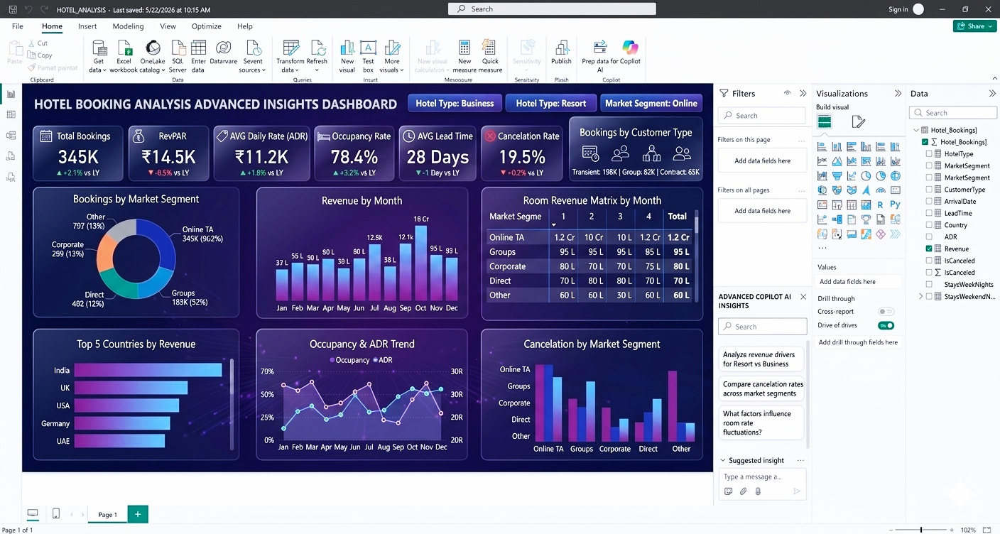

````md
# 🏨 Hotel Booking Analysis Dashboard

<p align="center">
  
</p>

<p align="center">
  
  
  
</p>

---

## 📌 Overview

The **Hotel Booking Analysis Dashboard** is an interactive **Business Intelligence** project built to analyze hotel booking patterns, revenue trends, occupancy performance, and cancellation behavior.

This dashboard transforms raw booking data into meaningful insights that can support better decision-making in the hospitality industry.

The project focuses on:
- Booking trend analysis
- Revenue performance tracking
- Occupancy insights
- Cancellation analysis
- Customer and market behavior
- KPI-based decision support

---

## 🎯 Objective

The main goal of this project is to help hotel management understand:

- how bookings change over time
- which properties generate better revenue
- which customer segments contribute most
- how cancellations affect performance
- what actions can improve business outcomes

---

## ✨ Key Insights

- Total bookings and revenue trends
- Average Daily Rate (ADR) analysis
- Occupancy performance by hotel type / segment
- Cancellation rate monitoring
- Booking source analysis
- Seasonal demand patterns
- Country-wise / customer-wise booking trends

---

## 🛠️ Tools & Technologies

- **Power BI**
- **Power Query**
- **DAX**
- **Excel**
- **Data Visualization**
- **Data Cleaning**
- **Business Intelligence**

---

## 📊 Dashboard Features

### 1. Executive Overview
A high-level summary of the most important KPIs, including:
- Total bookings
- Revenue
- Occupancy rate
- Cancellation rate
- Average daily rate

### 2. Revenue Analysis
Tracks revenue trends across time and helps identify high-performing periods.

### 3. Booking Trends
Analyzes how booking volume changes by month, season, or category.

### 4. Cancellation Analysis
Highlights cancellation patterns and helps identify risk areas.

### 5. Customer / Market Insights
Provides a better understanding of booking behavior and market contribution.

---

## 📁 Project Structure

```bash
Hotel-Booking-Analysis-Dashboard/
│
├── dashboard/
│   └── dashboard-preview.png
│
├── data/
│   └── hotel_booking_data.xlsx
│
├── report/
│   └── Hotel_Booking_Analysis.pbix
│
├── README.md
└── LICENSE
````

---

## 📈 Business Value

This dashboard can help hotel businesses:

* improve booking strategy
* reduce cancellations
* monitor revenue growth
* identify peak demand periods
* optimize occupancy
* make data-driven decisions

---

## 🧠 What I Learned

While working on this project, I strengthened my understanding of:

* data cleaning and transformation
* dashboard design
* KPI reporting
* business analysis
* storytelling with data
* Power BI development

---

## 🖼️ Dashboard Preview

> Add your dashboard screenshot here to make the repository look more professional.

Example:

```md

```

---

## 🚀 How to Use

1. Download or clone the repository
2. Open the `.pbix` file in **Power BI Desktop**
3. Refresh the dataset if needed
4. Explore the interactive dashboard visuals
5. Analyze the KPIs and insights

---

## 🙌 Acknowledgement

This project was created as part of my learning journey in **Data Analytics and Business Intelligence**.

---

## 📬 Connect with Me

**Winjeet Singh**
AI & Data Science Enthusiast
Data Analytics | Power BI | Machine Learning | Business Intelligence

---

## ⭐ Support

If you found this project helpful:

* ⭐ Star the repository
* 🍴 Fork the project
* 📢 Share it with others

---

## 📜 License

This project is licensed under the **MIT License**.

```

## Recommended title style for GitHub
**Hotel Booking Analysis Dashboard | Power BI | Business Intelligence**

## Recommended short project summary
**An interactive Power BI dashboard that analyzes hotel bookings, revenue, occupancy, and cancellations to generate actionable business insights for the hospitality industry.**

```
